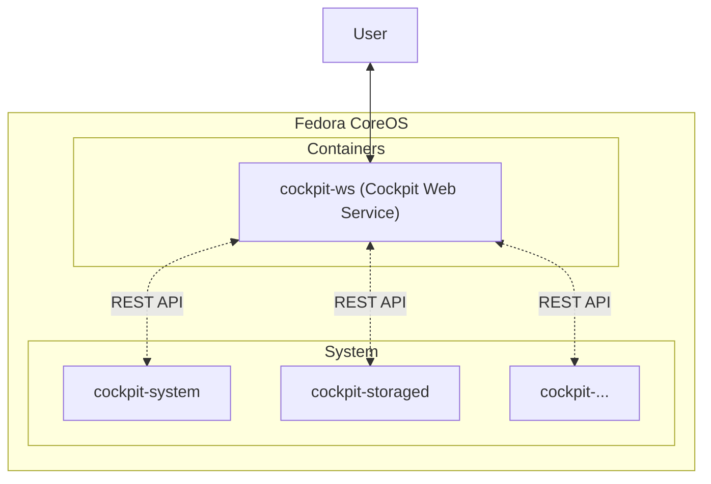

<!--


&emsp;&emsp;
 -->

最近淘汰下来一个 NUC，本着不浪费的原则，决定搞一台 NAS 玩玩。

既然要玩就玩个大的！黑群晖因为精神洁癖首先排除。至于什么 TrueNAS、OMV... 归根结底，他们大多都是方案的整合商 (TrueNAS 团队确实对 OpenZFS 项目做了不少的贡献)，就像 Ubuntu 之于 Debian；踩在巨人的肩膀上，降低了上手的难度；并不是 Ubuntu 模式有什么不好，但相比于 Arch Linux 或 Gentoo Linux 始终觉得它少了一分纯粹，让人喜欢不起来...

**既然大家都是方案的整合商，那为何不自己掌握自己的命运，自己来当这个整合商呢？**

于是就有了今天的故事。

## 提出方案并论证

我的方案总结想来就两个要点：

1. 所以服务尽可能的放在容器中
2. 系统层只读化、最小化和升级自动化

熟悉云原生的同学可能已经猜到了。没错，就是 [Fedora CoreOS](https://getfedora.org/en/coreos?stream=stable)！

Linux 系统运维从古至今有两个相互矛盾的追求：**安全性**和**稳定性**。“世界上没有绝对安全的系统”，但凡是软件都可能会有 Bug；有 Bug 不可怕，打上补丁修复掉就可以了。这就要求我们使用的软件尽可能的保持最新。但这就破坏了稳定性；新更新的软件可能会与旧有的软件相互冲突，甚至破坏整个系统！因此，时常能[在 Stack Overflow 看到 Arch Linux 用户抱怨自己又滚挂了](https://stackoverflow.com/search?q=%5Barchlinux%5D+update+fail) (我自己也遇到过)。

对于这个问题，红帽的 Fedora CoreOS 团队给出了他们的解法。这是我目前发现的，在安全性、稳定性以及可维护性之间平衡点最好的解决方案了！

在安全性方面，CoreOS 上来就是一个大招：**只读系统**。这简直是对安全性的降维打击！这意味着，即使黑客拿到了 Root 权限，也无法对系统进行更改，**因为整个系统都是只读的！**这同时也意味着用户无法随心所欲的安装软件，**因为整个系统都是只读的！**而作为替代，Fedora CoreOS 中默认便拥有 (由 [Podman](https://podman.io) 支持的) 容器运行环境。将应用层的所以软件、服务、负载都打包成标准化的容器，这也是云原生所倡导的最佳实践。

有了镜像化的只读的系统层作为支持，CoreOS 可以执行比 Arch Linux 更激进的升级策略：**不仅滚动升级，还要自动更新！**(突然想起了某 M 姓咖喱味系统) 但与 Arch Linux 靠信仰升级不同的是，CoreOS 有镜像化系统层作为保障；由于系统镜像中安装的软件都是固定的，每次升级都是对整个系统镜像的升级。并且每一个稳定版本 (Stable Stream) 发布前，都会经过测试版本 (Testing Stream) 和不要命版本 (Next Stream) 的沉淀；所以很难出现软件 A 与软件 B 冲突的情况。就算出现了升级失败的情况，Fedora CoreOS 也可以无感知的回滚到升级前的版本。

## 准备 Ignition 文件

与别的 Linux 发行版不同的是，安装 Fedora CoreOS 前需要准备一个 <ruby><rb>Ignition</rb><rt>点火</rt></ruby> 文件。

Ignition 是一个 JSON 文件，它被用于在初始配置中执行常见的磁盘任务，如分区、格式化、写入文件和配置用户。[`coreos-installer`](https://coreos.github.io/coreos-installer) 将在 (且仅在) 第一次启动过程中，从安装介质或您指定的位置读取 Ignition 配置，并将配置应用到机器。**相当于我们安装别的 Linux 时在引导程序中配置的内容提前写好，然后安装程序直接对着我们给的配置执行安装。**

在初始配置过程中使用 Ignition 来执行常见磁盘任务，如分区、格式化、写入文件和配置用户。

### 安装 Butane

如果你是个狠人，你当然可以手写 Ignition；但了更好的可读性，我们一般是先将配置写入一个 YAML 文件，然后再用 [Butane](https://coreos.github.io/butane) 将它转换成 Ignition 文件 (JSON)。


Mac 或 Linux 可以直接通过 Homebrew 或系统的包管理器安装，Windows 用户可以使用 [Docker Desktop](https://www.docker.com/products/docker-desktop) 安装容器版的 Butane：

```shell
# For Fedora User
sudo dnf install -y butane
# For Mac (Homebrew) User
brew install --formula butane
# Windows, Or you prefer to use containers
docker pull quay.io/coreos/butane:release
```

### 制作 Ignition 文件

然后我们参考着[文档](https://docs.fedoraproject.org/en-US/fedora-coreos/producing-ign)编写一份配置文件，这里我准备了一份示例：

```nas.yml
variant: fcos
version: 1.4.0
passwd:
  users:
    - name: core # 你的用户名
      ssh_authorized_keys:
        - ssh-rsa AAAA...
      # 设置你的密码 (通过 mkpasswd)
      # See: https://docs.fedoraproject.org/en-US/fedora-coreos/authentication/#_using_password_authentication
      password_hash: $y$j9T$Fd0/xTD2lR9...
storage:
  files:
    # 设置主机名
    - path: /etc/hostname
      mode: 0644
      contents:
        inline: nas
    # Fedora CoreOS 默认禁用基于密码的 SSH 登录
    # 开启它
    # 这个文件必须排在 40-disable-passwords.conf 之前
    - path: /etc/ssh/sshd_config.d/20-enable-passwords.conf
      mode: 0644
      contents:
        inline: PasswordAuthentication yes
    # 允许用户 core 通过用户密码 (不是 root 密码) 使用 sudo
    - path: /etc/sudoers.d/coreos-core-user
      mode: 0440
      contents:
        inline: core ALL=(ALL) ALL
# ...
```

最后，用 Butane 将其转换成 Ignition 文件：

```shell
# Use the binary version of Butane
butane --pretty --strict nas.yml > nas.ign
# Use the container version of Butane
docker run --rm -v ${PWD}:/data -w /data \
    quay.io/coreos/butane:release --pretty --strict nas.yml > nas.ign
```

制作好 Ignition 文件 (`nas.ign`) 后，将它上传到 GitHub Gist。

或者在内网中起一个用于传输文件的 HTTP 服务器：

```shell
python -m http.server
```

## 安装 Fedora CoreOS

这次我们准备直接在裸机上安装。如果你喜欢垫一层 EXSi 的话，可以参考[这篇文档](https://docs.fedoraproject.org/en-US/fedora-coreos/provisioning-vmware)。

### 制作 Live CD


需要提前准备一个容量 >= 2GB 的**空** U 盘 (建议至少 4GB 以上)。


对于裸机安装，我们有 Live CD 和 PXE/iPXE 两种方案。这里我只介绍更加基础和通用的通过 Live CD 安装 Fedora CoreOS 的方法，对于 PXE/iPXE 有需求的同学可以看看[这里](https://docs.fedoraproject.org/en-US/fedora-coreos/bare-metal/#_installing_from_the_network)。

我们需要在[这里](https://getfedora.org/en/coreos/download?tab=metal_virtualized&stream=stable&arch=x86_64)下载 Live CD 的 ISO 文件：


或者，通过 `coreos-installer` 下载：

```shell
# Use the binary version of coreos-installer
coreos-installer download -s stable -p metal -f iso
# Use the container version of coreos-installer
docker run --rm -v ${PWD}:/data -w /data \
    quay.io/coreos/coreos-installer:release download -s stable -p metal -f iso
```

如果你使用 Linux 或 Mac，可以直接使用系统自带的 `dd` 命令制作启动盘：

```shell
# 假设你的 U 盘挂载在 /dev/sda4
sudo dd if=${PWD}/fedora-coreos-*.iso of=/dev/sda4 bs=4M
```

如果你使用 Windows，推荐你使用 [Rufus](https://rufus.ie) 的 `DD Image` 模式刻录。

### 安装系统

## 安装 Cockpit 核心包

**标准 Fedora CoreOS 镜像中不包含 Cockpit。**

Fedora CoreOS 中默认不包含 Cockpit，修改系统又不被允许，要怎么安装 Cockpit 呢？确实，我们没有办法直接对运行中系统进行任何修改，RPM 和 YUM 也不存在，但不代表我们不能修改系统的镜像！

其实，Fedora CoreOS 中存在类似于「表」、「里」两套系统，「表」系统，及运行中的、只读的那套系统；而「里」系统就是「表」系统的镜像。所谓升级 (安装软件) 就是把新的软件安装在「里」系统中，然后再在重启的过程中将「里」系统挂载为「表」系统。没错，在 CoreOS 中升级 (安装) 了新软件后，需要重启才能生效 (如此一看更像那个咖喱味系统了 😓)！

我这里用了“系统镜像”这个词，但它由与传统的 ISO 镜像有所不同；它在镜像的内部是有分层的，整体呈现一种树形结构。也因此，红帽将这种「表」、「里」系统的技术称作 OSTree。按照官方的说法，这是一套<ruby><rb>“操作系统二进制文件的 Git”</rb><rt>git for operating system binaries</rt></ruby>，它允许你对整个操作系统的镜像进行 Add、Commit 或 Checkout。甚至，你还可以对每一层 (refs) 进行追踪和校验 (黑客听了头皮发麻)。如果你对 OSTree 感兴趣，可以查看他们的[官方文档](https://ostreedev.github.io/ostree/introduction)。

在 CoreOS 中，我们用 `rpm-ostree` 向「里」系统安装软件并制作新的系统镜像。

通过 `rpm-ostree` 安装 Cockpit 的核心包：

```shell
sudo rpm-ostree install cockpit-system
```

除此之外你还可以根据需求安装 `cockpit-*` 为名的别的软件包，它们为 Cockpit 提供拓展。例如，你如果想通过 Cockpit 管理 RQAID 磁盘阵列，就需要安装 `cockpit-storaged` (作为 NAS 肯定要安装这个)。

这里我简单整理了一下几个比较常用的 Cockpit 扩展：

| 软件包                   | 官方支持？ | 描述                                                        |
| ------------------------ | ---------- | ----------------------------------------------------------- |
| `cockpit-storaged`       | ✅         | 管理系统的存储。支持本地分区、加密、NFS、**RAID**、iSCSI 等 |
| `cockpit-networkmanager` | ✅         | 管理您的网络接口并轻松**编辑防火墙**                        |
| `cockpit-ostree`         | ✅         | 在浏览器中升级基于 OSTree 的系统                            |
| `cockpit-machines`       | ✅         | 在浏览器中创建、运行和**管理虚拟机**                        |
| `cockpit-podman`         | ✅         | 在浏览器中下载、使用和**管理容器** (基于 Podman)            |
| `cockpit-selinux`        | ✅         | 查看和管理 SELinux 异常。                                   |
| `cockpit-kdump`          | ✅         | 调试 Linux 内核？这个 `kdump` 插件有助于捕获堆栈的痕迹      |
| `cockpit-sosreport`      | ✅         | 从系统中收集系统配置和诊断信息                              |

由于 OSTree 的特性，安装完成后需要重启系统才会生效。

## 安装 Cockpit Web Service

刚刚我们安装了一大堆 `cockpit-*` (Cockpit 的核心程序和其扩展) 将 NAS 的各种功能通过 API 的形式暴露了出来；现在，为了更好的管理我们的 NAS，我们要为他们安装一个基于 Web 的 Dashboard。

当然，本着能容器化尽容器化的原则，这个 Dashboard 应该跑在容器中。

它与 `cockpit-*` 的关系大致如下：



1. 确保你的系统允许你使用[基于密码的 SSH 登录](#制作-ignition-文件) (默认是不允许的)：

```shell
cat /etc/ssh/sshd_config.d/02-enable-passwords.conf
# 如果显示不存在这个文件，使用以下命令开启对基于密码的 SSH 登录的支持
echo 'PasswordAuthentication yes' | sudo tee /etc/ssh/sshd_config.d/02-enable-passwords.conf
sudo systemctl try-restart sshd
```

2. 使用特权容器 (以 Root 身份) 运行 Cockpit Web Service：

```shell
sudo podman container runlabel --name cockpit-ws RUN quay.io/cockpit/ws
```

3. 使 Cockpit Web Service 在开机时启动：

```shell
sudo podman container runlabel INSTALL quay.io/cockpit/ws
sudo systemctl enable cockpit.service
```

然后，像往常一样使用浏览器登录主机 IP 地址上的端口 `9090`。

## 创建并挂载 RAID 1 磁盘阵列

## 基于容器安装其他应用层服务

### 安装 Samba 服务

### 安装 Webdav 服务 (基于 Nginx)
