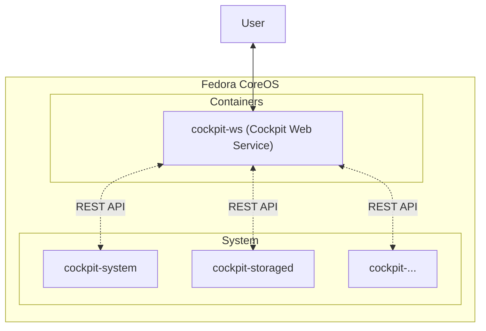

<!--


&emsp;&emsp;
 -->

最近淘汰下来一个 NUC，本着不浪费的原则，决定搞一台 NAS 玩玩。

既然要玩就玩个大的！黑群晖因为精神洁癖首先排除。至于什么 TrueNAS、OMV... 归根结底，他们大多都是方案的整合商 (TrueNAS 团队确实对 OpenZFS 项目做了不少的贡献)，就像 Ubuntu 之于 Debian；踩在巨人的肩膀上，降低了上手的难度；并不是 Ubuntu 模式有什么不好，但相比于 Arch Linux 或 Gentoo Linux 始终觉得它少了一分纯粹，让人喜欢不起来...

**既然大家都是方案的整合商，那为何不自己掌握自己的命运，自己来当这个整合商呢？**

于是就有了今天的故事。

## 方案的提出与论证

我的方案总结想来就两个要点：

1. 所以服务尽可能的放在容器中
2. 系统层只读化、最小化和升级自动化

熟悉云原生的同学可能已经猜到了。没错，就是 [Fedora CoreOS](https://getfedora.org/en/coreos?stream=stable)！

Linux 系统运维从古至今有两个相互矛盾的追求：**安全性**和**稳定性**。“世界上没有绝对安全的系统”，但凡是软件都可能会有 Bug；有 Bug 不可怕，打上补丁修复掉就可以了。这就要求我们使用的软件尽可能的保持最新。但这就破坏了稳定性；新更新的软件可能会与旧有的软件相互冲突，甚至破坏整个系统！因此，时常能[在 Stack Overflow 看到 Arch Linux 用户抱怨自己又滚挂了](https://stackoverflow.com/search?q=%5Barchlinux%5D+update+fail) (我自己也遇到过)。

对于这个问题，红帽的 Fedora CoreOS 团队给出了他们的解法。这是我目前发现的，在安全性、稳定性以及可维护性之间平衡点最好的解决方案了！

在安全性方面，CoreOS 上来就是一个大招：**只读系统**。这简直是对安全性的降维打击！这意味着，即使黑客拿到了 Root 权限，也无法对系统进行更改，**因为整个系统都是只读的！**这同时也意味着用户无法随心所欲的安装软件，**因为整个系统都是只读的！**而作为替代，Fedora CoreOS 中默认便拥有 (由 [Podman](https://podman.io) 支持的) 容器运行环境。将应用层的所以软件、服务、负载都打包成标准化的容器，这也是云原生所倡导的最佳实践。

有了镜像化的只读的系统层作为支持，CoreOS 可以执行比 Arch Linux 更激进的升级策略：**不仅滚动升级，还要自动更新！**(突然想起了某 M 姓咖喱味系统) 但与 Arch Linux 靠信仰升级不同的是，CoreOS 有镜像化系统层作为保障；由于系统镜像中安装的软件都是固定的，每次升级都是对跟个系统镜像的升级。并且每一个稳定版本 (Stable Stream) 发布前，都会经过测试版本 (Testing Stream) 和不要命版本 (Next Stream) 的沉淀；所以很难出现软件 A 与软件 B 冲突的情况。就算出现了升级失败的情况，Fedora CoreOS 也可以无感知的回滚到升级前的版本。

## 安装 VMware ESXi

Fedora CoreOS 的前身 CoreOS 在被红帽收购前是一家专注于云原生的独角兽公司。他们开发 CoreOS 的初衷只有一个：为了负载 Kubernetes。自然而然 Fedora CoreOS 也将云 (虚拟机) 作为第一运行环境。但也不是说 Fedora CoreOS 不能在裸机上部署，为此 Fedora CoreOS 提供了 [Live CD](https://getfedora.org/en/coreos/download?tab=metal_virtualized&stream=stable) 和 [`coreos-installer`](https://coreos.github.io/coreos-installer) 作为引导程序。

因为有读者这样爱折腾的人，[简中互联网上关于安装 ESXi 的教程](https://duckduckgo.com/?q=EXSi+%E5%AE%89%E8%A3%85)实在是太多了，这里就不再赘述了 (但是要注意，**Fedora CoreOS 要求 VMware ESXi 的版本 ≥ 6.5**)。

## 安装 Fedora CoreOS

### 准备 Ignition 文件

## 安装 Cockpit

标准 Fedora CoreOS 镜像中不包含 Cockpit。

通过 `rpm-ostree` 安装 Cockpit 的核心包：

```shell
sudo rpm-ostree install cockpit-system
```

除此之外你还可以根据需求安装 `cockpit-*` 为名的别的软件包，它们为 Cockpit 提供拓展。例如，你如果想通过 Cockpit 管理 RQAID 磁盘阵列，就需要安装 `cockpit-storaged` (作为 NAS 肯定要安装这个)。

这里我简单整理了一下几个比较常用的 Cockpit 扩展：

| 软件包                   | 官方支持？ | 描述                                                        |
| ------------------------ | ---------- | ----------------------------------------------------------- |
| `cockpit-storaged`       | ✅         | 管理系统的存储。支持本地分区、加密、NFS、**RAID**、iSCSI 等 |
| `cockpit-networkmanager` | ✅         | 管理您的网络接口并轻松**编辑防火墙**                        |
| `cockpit-ostree`         | ✅         | 在浏览器中升级基于 OSTree 的系统                            |
| `cockpit-machines`       | ✅         | 在浏览器中创建、运行和**管理虚拟机**                        |
| `cockpit-podman`         | ✅         | 在浏览器中下载、使用和**管理容器** (基于 Podman)            |
| `cockpit-selinux`        | ✅         | 查看和管理 SELinux 异常。                                   |
| `cockpit-kdump`          | ✅         | 调试 Linux 内核？这个 `kdump` 插件有助于捕获堆栈的痕迹      |
| `cockpit-sosreport`      | ✅         | 从系统中收集系统配置和诊断信息                              |

## 创建并挂载 RAID 1 磁盘阵列

## 基于容器的应用层服务

### 安装 Cockpit Web Service

还记得我们刚刚安装的那一大堆 `cockpit-*` (Cockpit 的核心程序和其扩展) 吗？它们将 NAS 的各种功能通过 API 的形式暴露了出来；现在，为了更好的管理我们的 NAS，我们要为他们安装一个基于 Web 的 Dashboard。

当然，本着能容器化尽容器化的原则，这个 Dashboard 应该跑在容器中。

它与 `cockpit-*` 的关系大致如下：



1. 确保你的系统允许你使用基于密码的 SSH 登录，除非你只使用 [SSO 登录](https://cockpit-project.org/guide/latest/sso.html)：

```shell
echo 'PasswordAuthentication yes' | sudo tee /etc/ssh/sshd_config.d/02-enable-passwords.conf
sudo systemctl try-restart sshd
```

2. 使用特权容器 (以 Root 身份) 运行 Cockpit Web Service：

```shell
sudo podman container runlabel --name cockpit-ws RUN quay.io/cockpit/ws
```

3. 使 Cockpit 在开机时启动：

```shell
sudo podman container runlabel INSTALL quay.io/cockpit/ws
sudo systemctl enable cockpit.service
```

然后，像往常一样使用浏览器登录主机 IP 地址上的端口 `9090`。

### 安装 Samba 服务

### 安装 Webdav 服务 (基于 Nginx)
