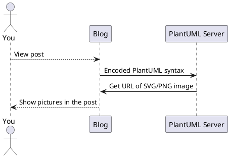
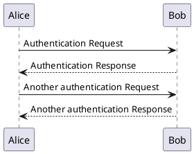

<!-- 


&emsp;&emsp;
plaintext
 -->

PlantUML 是一个很好用的开源工具，可以通过简单的文字描述生成**时序图，用例图，类图，活动图，组件图，状态图，对象图，部署图 ...** 等常用 UML 图。

我写博客的时候有时候也会用到 UML 图，特别是技术性文章时，但 Hugo 默认不支持 PlantUML，不过我们可以通过修改 Hugo 主题支持 PlantUML。

**我开发的 [mogege](https://github.com/Mogeko/mogege#plantuml) 主题已经实现了对 PlantUML 的支持，可以直接用**

## 开发过程

支持 PlantUML 的开发过程可谓是一波三折，不记录下来对不起我牺牲的脑细胞，不想看我啰嗦的[戳这里](#在-hugo-主题中实现)

首先，我先搜索了一下，看有没有已经造好了的轮子。然后发现已经有人给 Hugo 主题 [Academic](https://github.com/gcushen/hugo-academic) 的作者提过[希望支持 PlantUML 的建议](https://github.com/gcushen/hugo-academic/issues/1110)了。看完那篇 Issue 后心瞬间凉了一半。Academic 的作者觉得 PlantUML 需要依赖 Hugo 以外的软件，这个软件还是基于 Java 开发的，操作起来太复杂了，所以拒绝了建议

> Closing as PlantUML is not client side JS, also it's not currently  supported by Hugo even if PlantUML has been manually installed locally: [gohugoio/hugo#796](https://github.com/gohugoio/hugo/issues/796).
>
> The recommendations for diagramming can be found here: <https://sourcethemes.com/academic/docs/writing-markdown-latex/#diagrams>
>
> Also, I have opened [#1111](https://github.com/gcushen/hugo-academic/issues/1111) to consider integrating Mermaid.js for generating diagrams.

就在我准备放弃时，看到了这篇文章：[Markdown native diagrams with PlantUML](https://blog.anoff.io/2018-07-31-diagrams-with-plantuml/)

这篇文章介绍了 [PlantUML 官方的 Online Server](http://www.plantuml.com/plantuml/uml/SyfFKj2rKt3CoKnELR1Io4ZDoSa70000)，该服务器提供 RESTful API，你只需要将 PlantUML 代码编码，然后发送给服务器，服务器就会返回渲染好的 PNG 或 SVG 图片。VSCode 的 [PlantUML 扩展](https://marketplace.visualstudio.com/items?itemName=jebbs.plantuml)就是基于这个方案实现的。

这种编码类似于 (但不是) Base64 编码。我们只需要用 JavaScript 捕捉并编码 PlantUML 代码块，然后发送给 PlantUML 官方的 Online Server，再将返回的 SVG 图片插入到 DOM 树中就可以了。流程如图：



(👆这张图就是通过 PlantUML Server 实时生成的)

官方也为这种用法给出了一个[参考实现](https://plantuml.com/zh/code-javascript-synchronous)。所以现在只需要去 NPM 上找一个轮子就好了。打开 NPM 一搜，果然有不少轮子，但几乎所有实现都是基于 Node.js 的，没有一个可以用的 QAQ


就在我又双叒准备放弃时，终于在互联网的卡卡角角里找到了这个库 [jmnote/plantuml-encoder](https://github.com/jmnote/plantuml-encoder)

终于可以开工了 \_(:з」∠)\_

## 在 Hugo 主题中实现

实现很简单，只需要在主题引用 JavaScript的地方 (我的是 `./layouts/partials/js.html`) 插入：

```html
{{ if or .Page.Params.plantuml .Site.Params.plantuml }}
<!-- PlantUML -->
<script src="https://cdn.jsdelivr.net/gh/jmnote/plantuml-encoder@1.2.4/dist/plantuml-encoder.min.js" integrity="sha256-Qsk2KRBCN5qVZX7B+8+2IvQl1Aqc723qV1tBCQaVoqo=" crossorigin="anonymous"></script>
<script>
(function(){
  let plantumlPrefix = "language-plantuml";
  Array.prototype.forEach.call(document.querySelectorAll("[class^=" + plantumlPrefix + "]"), function(code){
    let image = document.createElement("IMG");
    image.loading = 'lazy'; // Lazy loading
    image.src = 'http://www.plantuml.com/plantuml/svg/~1' + plantumlEncoder.encode(code.innerText);
    code.parentNode.insertBefore(image, code);
    code.style.display = 'none';
  });
})();
</script>
{{ end }}
```

第一行的 `{{ if or .Page.Params.plantuml .Site.Params.plantuml }}` 相当于两个开关，分别控制 PlantUML 在**全局**和**单个文章内**开启与否 (默认是关闭的)

全局开启 PlantUML 需要在 `config.toml` 中配置：

```toml
[params]
  plantuml = true
```

如果需要为单个页面开启，则在文章开头的配置区添加

```yml
plantuml: true
```

然后再文章中使用 <code>&#96;&#96;&#96;plantuml</code> 标记需要被渲染的 PlantUML 语法块

```markdown
​```plantuml
PlantUML 语法块
​```
```

## 效果如下

```plaintext
​```plantuml
@startuml
Alice -> Bob: Authentication Request
Bob --> Alice: Authentication Response

Alice -> Bob: Another authentication Request
Alice <-- Bob: Another authentication Response
@enduml
​```
```


