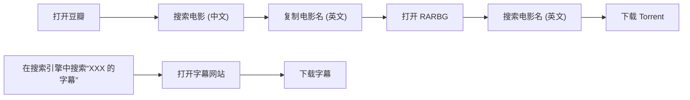
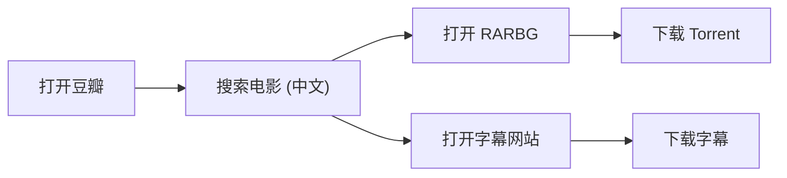

<!-- 


&emsp;&emsp;
 -->

今天来教教大家如何正确的找电影 (电视剧) 资源！

嘿嘿，其实是来推销我写的 UserScript 的。

## 神奇的 Torrent 网站们

众所周知，外面的世界有很多神奇的 Torrent 网站。比如大名鼎鼎的[海盗湾 (TPB)](https://thepiratebay.org)；专注于电影、电视剧和游戏的 [RARBG](https://rarbg.to/torrents.php)，(有些电影国内都还没上映，它就先有资源了)...

但这些网站都有一个共同的缺点：不支持中文！

其实只是网站不支持中文还好，GitHub 也没有中文我照样用得很开心。但问题是它也不支持用中文搜索电影！WTF？现在电影想在国内宣发，最基础的就是要取一个中文译名。如果不是电影看得多，谁能想到[碟中谍](https://movie.douban.com/subject/1292484)的英文名叫 *Mission: Impossible*？

## 老办法

因此我们在使用 RARBG 找电影前往往需要先去豆瓣、Wikipedia 等网站找到该电影的英文名，然后再前往 RARBG 搜索。


如果要下载字幕的话还要从头开始。

具体流程为：



这样找电影也不是很麻烦，但过程很机械，次数多了就烦了。

“要是能直接从豆瓣跳转到相应的 RARBG 页面就好了！”，于是我写了一个 [UserScript](https://github.com/mogeko/userscript-douban2rarbg) 来完成这一切。

## 新方法

简单的解释一下 UserScript 是什么？

简单的说，UserScript 就是一个运行在特定网站上的非官方 JavaScript 脚本。它一般在网站加载完毕后运行，用来扩展或修改网站的功能。

~~对 XXX 不满意？自己动手，教 XXX 做网站！~~

还是以[碟中谍](https://movie.douban.com/subject/1292484)为例，我使用 UserScript 在的碟中谍的豆瓣页面上增加了“资源”和“字幕”。


“资源”部分提供了指向此电影在几个常用的 Torrent 网站 ([RARBG](https://rarbg.to/torrents.php)、 [TorrentGalaxy](https://torrentgalaxy.to) 和 [海盗湾 (TPB)](https://thepiratebay.org)) 中的相应页面的链接。

“字幕”部分则指向了可以下载此电影的字幕的网站们：[opensubtitles](https://www.opensubtitles.org)、[SubHD](https://subhd.tv)、[字幕库](https://zimuku.org)、[R3SUB](https://r3sub.com) 和 [点点字幕](http://www.ddzimu.com)

此时，找电影的流程被大大压缩：



### 安装 UserScript

首先，使用 UserScript 需要为浏览器安装插件 [Tampermonkey (推荐)](https://www.tampermonkey.net) 或 [Greasemonkey](https://www.greasespot.net)。

然后用安装好 UserScript 插件的浏览器打开这个[链接](https://greasyfork.org/scripts/427181-douban2rarbg/code/Douban2RARBG.user.js#bypass=true)。

然后就安装完成了！快随便打开一个[电影 (电视剧) 的豆瓣页面](https://movie.douban.com/subject/26629153/)看看效果！

## 附录

如果你感兴趣，这里是 UerScript 的源代码 (TypeScript):

```TypeScript
// @version 0.6.0

const META_DATA = {
  资源: {
    RARBG: "https://rarbg.to/torrents.php?imdb=%i",
    "RARBG (Mirror)": "https://rarbgmirror.com/torrents.php?imdb=%i",
    TorrentGalaxy: "https://torrentgalaxy.to/torrents.php?search=%i",
    TPB: "https://thepiratebay.org/search.php?q=%i",
  },
  字幕: {
    opensubtitles:
      "https://www.opensubtitles.org/zh/search/imdbid-%x/sublanguageid-all/moviename-%i",
    SubHD: "https://subhd.tv/search/%d",
    字幕库: "https://so.zimuku.org/search?q=%i",
    R3SUB: "https://r3sub.com/search.php?s=%i",
    点点字幕: "http://www.ddzimu.com/download/xslist.php?key=%d",
  },
};

(function () {
  const metaRoot = document.querySelector("#info");
  const imdb = metaRoot?.textContent?.match(/tt[0-9]{4,}/)?.[0];
  const doubanID = document.location.toString().split("/")[4];

  if (!imdb || !doubanID) return;

  Object.entries(META_DATA).forEach(([key, sites]) => {
    const metaNode = document.createElement("span");
    const plNode = document.createElement("span");
    const attrsNode = document.createElement("span");
    const br = document.createElement("br");

    plNode.setAttribute("class", "pl");
    plNode.textContent = `${key}: `;

    const links = Object.entries(sites).map(([title, template]) => {
      const handleTemplate = (template: string) => {
        const [i, d, x] = [imdb, doubanID, imdb.replace(/^tt/, "")];

        return template.replace("%i", i).replace("%d", d).replace("%x", x);
      };
      const link = document.createElement("a");

      link.setAttribute("href", handleTemplate(template));
      link.setAttribute("target", "_blank");
      link.textContent = title;

      return link;
    });

    attrsNode.setAttribute("class", "attrs");
    links.forEach((link, index, array) => {
      attrsNode.appendChild(link);
      if (index !== array.length - 1) {
        attrsNode.innerHTML += " / ";
      }
    });

    metaNode.appendChild(plNode);
    metaNode.appendChild(attrsNode);

    metaRoot.appendChild(metaNode);
    metaRoot.appendChild(br);
  });
})();

export {};
```

因为是用 TypeScript 编写的，所以不能直接使用，在你浏览器中运行的实际上是这个 (编译后的) [JavaScript 脚本](https://github.com/mogeko/userscript-douban2rarbg/blob/master/dist/Douban2RARBG.user.js)。

了解更多：

- [这个 UserScript 的 GitHub 页面](https://github.com/mogeko/userscript-douban2rarbg)
- [这个 UserScript 的 Greasy Fork 页面](https://greasyfork.org/zh-CN/scripts/427181-douban2rarbg)
